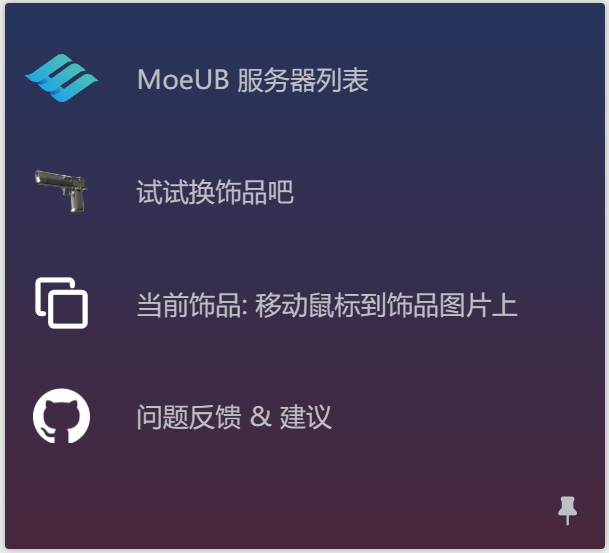
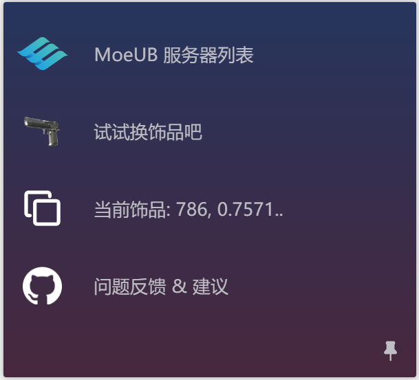

# CS2 MoeUB Tools

MoeUB 第三方辅助工具，在 悠悠有品、网易 Buff 网页下提供饰品代码的复制功能。

## 使用方法

1. 下载并安装浏览器油猴插件 [Tampermonkey](https://www.tampermonkey.net/)

2. 安装当前脚本 [CS2-MoeUB-Tools by GreasyFork](https://greasyfork.org/zh-CN/scripts/544393-moeub-%E7%AC%AC%E4%B8%89%E6%96%B9%E8%BE%85%E5%8A%A9%E5%B7%A5%E5%85%B7)

3. 打开交易平台网页，左侧出现 工具栏 代表安装成功

4. 点击工具栏中的 `当前饰品: xxx` 第三项，即可复制饰品代码，或通过快捷键 <kbd>Ctrl</kbd> + <kbd>C</kbd> 复制

5. 切换到游戏中，按波浪线 <kbd>~</kbd> 打开控制台，粘贴代码，按下回车 ok

    
    

## 补充

如果您使用过程中发现不足或遇到问题，欢迎提交 Issue 或 Pull Request，如果您觉得不错欢迎点个 Star 3Q。

当前工具的样式参考了 [Steam Inventory Helper](https://steaminventoryhelper.com/)
